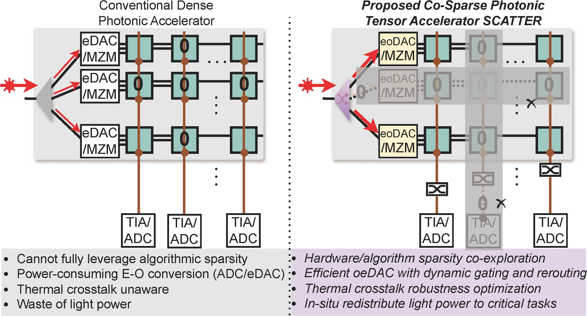

# SCATTER 

By [Ziang Yin](https://scopex-asu.github.io/index.html), Nicholas Gangi, Meng Zhang, [Jeff Zhang](https://search.asu.edu/profile/4346755), [Rena Huang](https://faculty.rpi.edu/rena-huang) and [Jiaqi Gu](https://scopex-asu.github.io/index.html).

This repo is the official implementation of ["SCATTER: Algorithm-Circuit Co-Sparse Photonic Accelerator with Thermal-Tolerant, Power-Efficient In-situ Light Redistribution"](https://arxiv.org/abs/2407.05510)

[](https://opensource.org/licenses/MIT)

# Introduction
**SCATTER** is a novel algorithm-circuit co-sparse photonic accelerator featuring dynamically reconfigurable signal path via thermal-tolerant, power-efficient in-situ light redistribution and power gating. 
<p align="center">
  

</p>

**SCATTER** is designed to overcome the limitations of
traditional photonic accelerators with these key features: ➊ phase-agnostic incoherent photonic tensor cores for robust tensor computing; ➋ shared input modulation modules and readout circuitry to balance area, power, and control flexibility; 
<p align="center">
  

</p>
➌ in-situ tunable rerouter for light redistribution; 
<p align="center">
  

</p>
➍ hardware gating to support structured row-column sparsity with enhanced power efficiency and thermal crosstalk robustness; 
<p align="center">
  

</p>
➎ co-optimized devices, circuits, and architecture configurations with maximum efficiency and thermal variation tolerance.


**SCATTER** achieves a 511× area reduction and 12.4× power saving with superior crosstalk tolerance that enables unprecedented circuit layout compactness and on-chip power efficiency.
<p align="center">
  

</p>

A power-optimized, crosstalk-aware dynamic sparse training framework is introduced to explore row-column structured sparsity and ensure marginal accuracy loss and maximum power
efficiency. 
<p align="center">
  

</p>

# Dependencies
* Python >= 3.8
* pyutils >= 0.0.2. See [pyutils](https://github.com/JeremieMelo/pyutility) for installation.
* pytorch-onn >= 0.0.5. See [pytorch-onn](https://github.com/JeremieMelo/pytorch-onn) for installation.
* Python libraries listed in `requirements.txt`
* NVIDIA GPUs and CUDA >= 10.2

# Structures
* configs/: configuration files
* core/
    * models/
        * layers/
            * base_layer.py: base layer definition
            * tempo_conv2d.py: TeMPO convolution 2D block definition
            * tempo_linear.py: TeMPO linear block definition
            * utils.py: utility functions layers 
        * dst2.py: pruning scheduler definition
        * tempo_base.py: TeMPO base model definition
        * tempo_cnn.py: TeMPO CNN model definition
        * tempo_resnet.py: TeMPO resnet model definition
        * tempo_vgg.py: TeMPO vgg model definition
        * utils.py: utility functions for models
    * builder.py: build training utilities
    * utils.py: customized loss function definition
* hardware/
    * photonic_core_base.py: architecture simulator base definition
    * photonic_crossbar.py: architecture simulator for TeMPO definition
* MZIdata/
    * MZIPower.csv: real MZI power data
* scripts/: contains experiment scripts
* crosstalk_spacing.py: inference logic
* sparse_train.py: sparsity train logic
* train.py: train logic


# Usage
* Train benchmark `MODEL` using  **SCATTER**'s algorithm, replace `MODEL` with one option from (`cifar10/vgg8`, `cifar100/resnet18`, `fmnist/cnn/train`),\
`> python3 scripts/MODEL/train_origin.py`
* Or, train sparse `MODEL` using  **SCATTER**'s algorithm, replace `MODEL` with one option from (`cifar10/vgg8`, `cifar100/resnet18`, `fmnist/cnn/train`),\
`> python3 scripts/MODEL/train_sparse.py`
* Test the trained model with different hardware restriction. (Need to modify the path to trained checkpoint in the script).
`python3 scripts/MODEL/test_main_results.py`


# Citing SCATTER
```
@inproceedings{yin2024scatter,
      title={SCATTER: Algorithm-Circuit Co-Sparse Photonic Accelerator with Thermal-Tolerant, Power-Efficient In-situ Light Redistribution}, 
      author={Ziang Yin and Nicholas Gangi and Meng Zhang and Jeff Zhang and Rena Huang and Jiaqi Gu},
      year={2024},
      booktitle={International Conference on Computer-Aided Design (ICCAD)},
      url={https://arxiv.org/abs/2407.05510}, 
}
```
